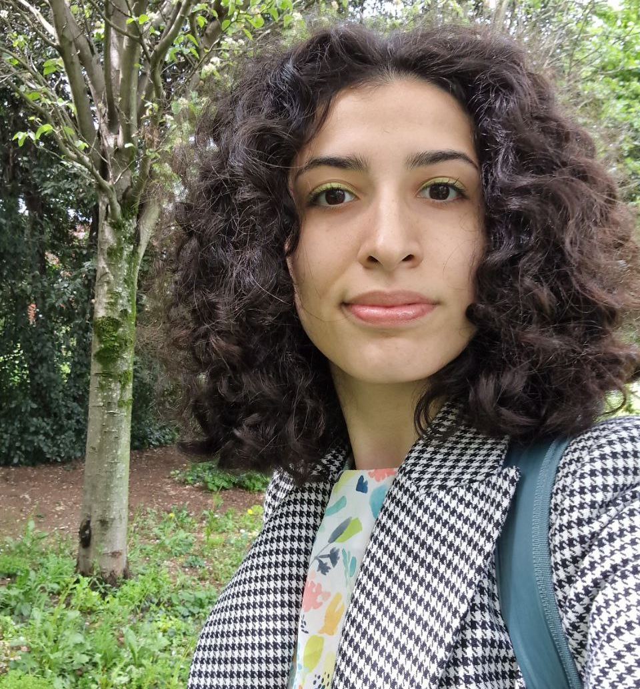

# Fig-Net
## Satellite on Fine-grained Temporal Networks 
[@ International School and Conference on Network Science (NetSci)](https://netsci2025.github.io/) 
2-3 June, 2025 
Maastricht, the Netherlands

Temporal networks have emerged as a crucial framework for studying dynamic systems, with applications in sociology, biology, and communication networks. With advancements in data collection technologies enabling increasingly precise and frequent observations, there is a growing need for methodologies capable of analyzing fine-grained temporal networks.

These networks are represented as datasets capturing interactions — whether instantaneous or time-extended - with high-resolution timestamps. However, research on fine-grained temporal networks remains limited, leaving many aspects unexplored. Fine-grained temporal networks are not merely traditional temporal networks observed at their fastest resolution. They represent a fundamental shift; with their extreme sparsity, traditional tensor-based approaches are ineffective, and static network representations become unobservable at any specific time. Fundamental concepts like node degrees, communities, clustering coefficients, and centralities must be redefined within this framework. What sets fine-grained temporal networks apart is their ability to uniquely preserve sequences of interactions and inter-event time windows, crucial for understanding causality and temporal dependencies. Traditional methods often aggregate this data into snapshots using arbitrarily chosen time windows, losing critical temporal details. Scalability presents another significant challenge due to the computational intensity of analyzing high-resolution datasets. Innovative methodologies are required to address these theoretical and computational challenges and enable deeper insights into the dynamics of temporal systems.

This satellite invites contributions that advance fine-grained temporal network research, focusing on novel methods, models, and applications. Much like higher-order networks, fine-grained temporal networks require a redefinition of foundational network concepts, promising a significant research trajectory in the coming years. 

## Topics 
Relevant submissions cover one or more of the following topics:
- Temporal networks  
- Dynamic community detection
- Dynamic/Event-driven systems modeling  
- Time-varying networks  
- Fairness and ethics in temporal network analysis
- Software for temporal graph analysis
- Graph machine learning
- Link prediction
- Weighted temporal networks
- Stream graphs
- Link streams
- Event detection
- Higher-order interactional data
- Heterogeneous temporal networks
Studies that combine complexity and temporal networks that do not fall within the above are also welcome!

## Important Dates
N/A

 

 
<b>Workshop Program Chairs</b>

  

  <a href="https://www.yasasgari.com"><b>Yasaman (Yas) Asgari</b></a>
  
University of Zurich

  <a href="https://andreafailla.github.io/"><b>Andrea Failla</b></a>
  
Unviersity of Pisa

 

  <a href="https://pages.di.unipi.it/citraro/"><b>Salvatore Citraro</b></a>
  
CNR-ISTI

  <a href="https://cazabetremy.fr/index.html"><b>Remy Cazabet</b></a>
  
University of Lyon 1

  <a href="https://alexbovet.github.io/"><b>Alexandre Bovet</b></a>
  
Unviersity of Zurich

